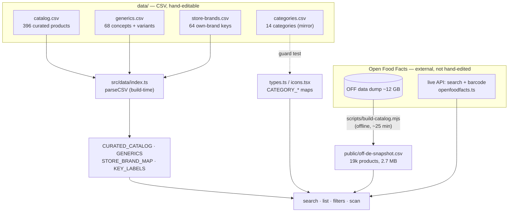
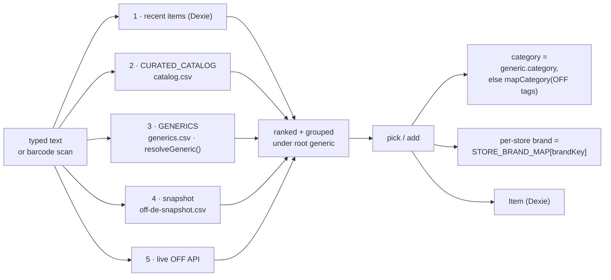

# `data/` — the editable lists & mappings

These CSVs are the **human-editable source of truth** for ShopList's curated
data. The app parses them at build time (Vite inlines each file via `?raw`, so
nothing extra ships and there's no runtime fetch). Edit a CSV → reload → done.
No code change, no regeneration step.

Open them in any spreadsheet or text editor. List-valued cells use `|` as the
separator (e.g. `rewe|edeka|aldi|lidl`); fields containing a comma are
double-quoted (e.g. `"Gewürze, Öle & Saucen"`).

| File | Rows | Loaded by | Status |
| --- | --- | --- | --- |
| `catalog.csv` | 396 | `src/data/index.ts` → `CURATED_CATALOG` | **source of truth** |
| `generics.csv` | 68 | `src/data/index.ts` → `GENERICS` | **source of truth** |
| `store-brands.csv` | 64 | `src/data/index.ts` → `STORE_BRAND_MAP` + `KEY_LABELS` | **source of truth** |
| `categories.csv` | 14 | mirror of `types.ts` + `icons.tsx` | mirror (guarded by a test) |
| `legacy-categories.csv` | 12 | mirror of `LEGACY_CATEGORY_MAP` | mirror (guarded by a test) |
| `category-rules.csv` | 129 | `scripts/build-catalog.mjs` (OFF→category) | **source of truth** (build-time) |
| `llm-generic-names.csv` | 19054 | `scripts/llm-generic-name.py join` → snapshot `generic` col | **gold standard** (LLM-labeled, by `code`) |

> Why are categories a mirror? The 14 categories define the `Category` **union
> type** used across the code, so they live in `types.ts`. `categories.csv` is a
> readable copy kept honest by `src/data/categories.sync.test.ts` — `npm test`
> fails if they drift. (Editing categories means editing `types.ts`/`icons.tsx`,
> then mirroring here — they change rarely.)

## Where the data comes from and how it reaches the app



## How a typed/scanned input becomes a list item

Search merges five knowledge sources, ranked; the pick resolves to a category +
per-store brand. Generic resolution happens first so variants group under one
header (e.g. "Quark" over Speisequark 20%/40%).



## Column reference

**catalog.csv** — `id, name, brand, category, icon, stores, sizes`
`category` is a slug from `categories.csv`; `icon` is an `icons-library` name;
`stores`/`sizes` are `|`-lists (`sizes` are numbers, e.g. `1|6|12|24`).

**generics.csv** — `id, name, category, parentId, aliases, icon, brandKey`
`parentId` points at another generic id (variant hierarchy). `aliases` is a
`|`-list of extra search terms (`spq|magerquark`). `icon`/`brandKey` are
inherited from the parent when blank.

**store-brands.csv** — `key, label, default_{aldi,lidl,rewe,edeka,dm,rossmann}, bio_{…}`
`key` is matched as a whole-token alias against item names; `label` is the
display noun. Each `default_*`/`bio_*` cell is that chain's own-brand (blank =
not carried there). Note grocery staples (Eier, Brot, Milch…) intentionally have
**empty `bio_dm`/`bio_rossmann`** — the drugstores don't carry them, and a value
here would surface the item under those store filters.

**categories.csv** — `slug, label, order, kind, defaultIcon, colorFg, colorBg, glyph, defaultStores`
The 14 supermarket-walk categories. `kind` is `grocery`|`drugstore`;
`defaultStores` is the floor every item in the category inherits.

**legacy-categories.csv** — `old, new` — remaps pre-14-category slugs on load.

## The long tail — `public/off-de-snapshot.csv`

`public/off-de-snapshot.csv` (19k products, ~2.7 MB) plus the live OFF API cover
everything the curated lists don't. It's CSV too — `code,name,brand,image,category,stores,generic`
— so it's greppable and spreadsheet-openable, but it is **generated, not
hand-edited**: `snapshot.ts` fetches and parses it at runtime, and `npm run
build:catalog` regenerates it from the OFF dump (editing a row would be
overwritten). The OFF-tag → category mapping it applies is the build-time source
of truth in `category-rules.csv` (loaded by `scripts/build-catalog.mjs`).

The last column, `generic`, is the **generic product name** (e.g. `Weizenbier
alkoholfrei` for an Erdinger SKU) — the key for grouping offers/alternatives
across brands. It is **not** produced by `build:catalog`; it's joined in by
`code` from `data/llm-generic-names.csv` (one-off Opus 4.7 labeling, see below).
`snapshot.ts` reads it into `Product.genericName`. Refresh order after an OFF
dump update:

```
npm run build:catalog                      # OFF dump → snapshot + off-de-full.csv
python3 scripts/llm-generic-name.py full   # label new codes (cached by code)
python3 scripts/llm-generic-name.py join   # stitch `generic` into the snapshot
```

## Generic product names — `data/llm-generic-names.csv`

The generic-product layer for the OFF long tail. Each of the 19k products gets a
clean German `generic_product_llm` name (head-noun first, brand/size/marketing
stripped) from a one-off Claude Opus 4.7 pass — kept as a **gold standard** keyed
by `code`, independent of the regenerable `off-de-full.csv`. Columns:
`code, name, generic_product_llm, model`. Built/refreshed by
`scripts/llm-generic-name.py` (`sample` → `run` to compare against the old regex
column; `full` to label everything; `join` to patch the snapshot). This
**supersedes the retired regex `product_type`** column that an earlier
`enrich-generics.py` produced.

## For data analysis — `data/off-de-full.csv`

The runtime snapshot above is deliberately lean (6 columns) so the app downloads
fast. For offline analysis the same build pass also emits a **wide** sibling,
`data/off-de-full.csv` — the identical 19k products carrying **all** the OFF
metadata worth keeping (29 columns). It is **generated and git-ignored** (it's
large and reproducible): run `npm run build:catalog` to populate it. Both files
come from the same dedup'd product set in one pass, so a `code` in the snapshot
always has a matching row here.

Columns, grouped:

- **identity** — `code, name, generic_name, brand, brands`
- **classification** — `category` (our slug), `off_categories`, `stores`, `countries`, `labels`, `packaging`, `quantity`
- **scores** — `nutriscore, nova_group, ecoscore`
- **nutrition per 100 g** — `energy_kcal_100g, fat_100g, saturated_fat_100g, carbohydrates_100g, sugars_100g, fiber_100g, proteins_100g, salt_100g`
- **composition** — `ingredients_text, allergens, additives_n`
- **meta** — `completeness, popularity_key, image`

Tag-like fields (`off_categories`, `countries`, `labels`, `packaging`,
`allergens`) keep OFF's full `|`-joined tag lists; numeric fields are blank when
OFF has no value. Use it in a notebook/spreadsheet — it is never loaded by the
app.

Icon SVG paths live in `src/icons-library*.tsx` — they're code (JSX markup), not
tabular data, so they're not CSV; the natural editable form for them would be
one `.svg` file per icon (a possible follow-up).
