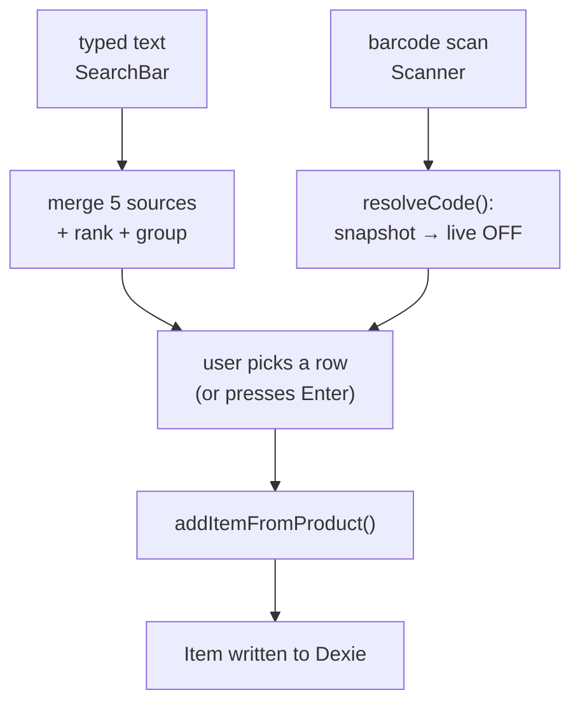
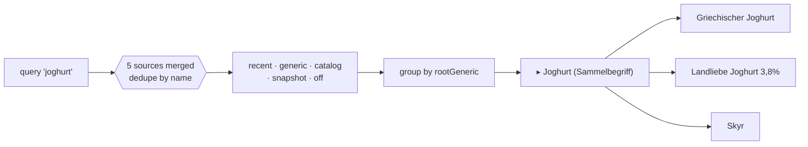
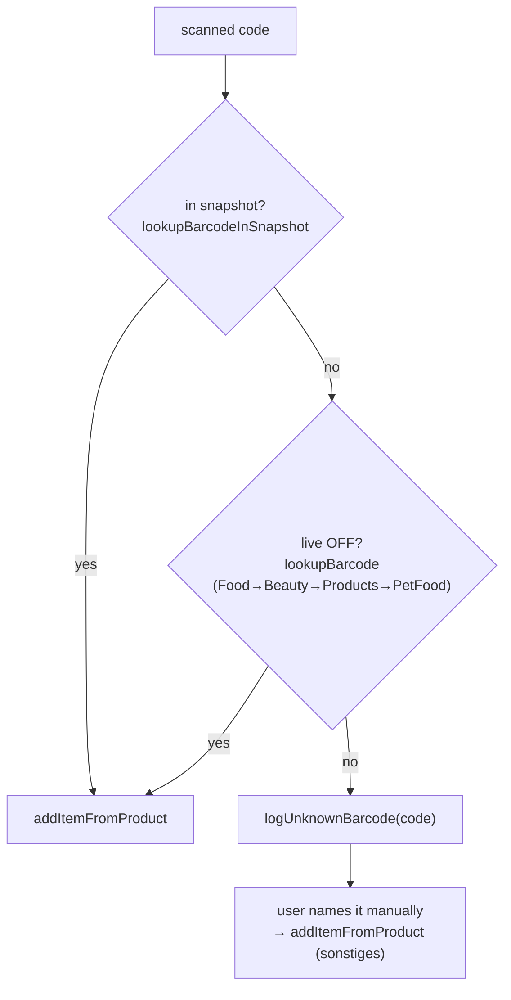

# Search & mapping logic — how an input becomes a list item

This is the current, as-built description of what happens between the moment a
user types or scans something and the moment a row appears on the list. It
covers the two entry points (typed search, barcode scan), the five knowledge
sources the typed search merges, how results are ranked and grouped, and the
single funnel (`addItemFromProduct`) every add passes through — including how the
**category**, **generic**, **display name**, and **stores** of the resulting
item are decided.

For where the underlying data lives and how it's loaded, see
[`data/README.md`](../data/README.md). This doc is about the *runtime* logic that
consumes that data.

> Terminology: a **Product** is a candidate (a catalog row, a snapshot row, an
> OFF hit, a synthesized generic). An **Item** is what actually lands on the
> list. A **Generic** is the brand-agnostic concept ("Joghurt") that SKUs and
> variants roll up to — see [`src/generics.ts`](../src/generics.ts).

---

## The two entry points



Both paths converge on **`addItemFromProduct`** ([`src/store.ts`](../src/store.ts)).
That function — not the search — is where the durable decisions (display name,
generic, stores, dedupe) are made. Read it as the source of truth; the search UI
just produces a candidate `Product` to feed it.

---

## Path A — typed search

Lives in [`src/components/SearchBar.tsx`](../src/components/SearchBar.tsx). As the
user types, three things happen on different schedules, then everything is merged
in one `useMemo`.

### The five sources (in merge priority order)

`allSuggestions` walks the sources below **in this order** and dedupes by
**lower-cased name, first-seen wins**. Order is deliberate: the generic tier is
injected *above* the flat catalog so the umbrella term and its variants win the
name-dedupe over a flat catalog row for the same concept.

| # | Source | Where | Gate | Ranking |
| --- | --- | --- | --- | --- |
| 1 | **recent** | `db.recent` (Dexie) | `q.length ≥ 1` | substring `name.includes(q)` |
| 2 | **generic** | `searchGenerics(q, 20)` → `genericToProduct` | always | exact → prefix → token-subset |
| 3 | **catalog** | `searchCatalog(q, 20)` over `CURATED_CATALOG` (`catalog.csv`) | always | exact → prefix → all-tokens → contains |
| 4 | **snapshot** | `searchSnapshot(q, 40)` over `off-de-snapshot.csv` | `q.length ≥ 2` | exact → prefix → all-tokens |
| 5 | **off** | live `searchProducts(q)` (OFF API) | `q.length ≥ 3`, 500 ms debounce | order returned by OFF |

Sources 4 and 5 are asynchronous: their results are fetched in `useEffect`s and
stored in React state (`snapshotResults`, `offResults`), so the dropdown fills in
progressively — local sources first, the live API a beat later. The snapshot is
fetched once at app start (`warmSnapshot`) and cached.

### Ranking inside a source

All four ranked sources share the same normalization (`norm`: lower-case, German
fold `ä/ö/ü/ß → a/o/u/ss`, strip diacritics, non-alphanumerics → spaces) and the
same tiered idea — **exact match, then prefix, then "all query tokens appear
somewhere"** — comparing both the spaced and the de-spaced ("joghurt" vs "jo
ghurt") forms. The generic index (`MATCH_INDEX`) additionally folds in each
generic's `aliases` and is pre-sorted most-specific-first so
"griechischer joghurt" beats bare "joghurt".

### Grouping under the root generic

After merge + optional category-chip filter, rows are grouped so variants nest
under one header — "Joghurt" over "Griechischer Joghurt", "Landliebe Joghurt",
etc. (`groups` useMemo):

1. For each suggestion, find its generic:
   `gid = s.genericId ?? resolveGeneric(s.name, s.category)`.
2. Walk to the top ancestor: `rootId = rootGeneric(gid) ?? getGeneric(gid)`.
3. Bucket suggestions by `rootId`, preserving first-seen order.
4. A bucket renders a **header** when its root exists *and* has at least one child
   (a row whose name differs from the root's). The row that literally repeats the
   umbrella term is folded into the header — clicking the header adds
   `genericToProduct(root)`.
5. A budget of `MAX_SHOWN = 14` is spread across headers + rows; buckets with no
   matching root render flat (the OFF long tail and custom items have no generic).



### Committing the pick

- **Tapping a row** → `pick(p)` → `addItemFromProduct(p, { pinToStore })`.
- **Tapping a generic header** → adds `genericToProduct(root)` (a synthesized
  Product carrying `genericId` and category-default stores).
- **Pressing Enter / the "„…" hinzufügen" button** → `addLiteral()`: adds the top
  suggestion (`categoryFiltered[0] ?? allSuggestions[0]`) if there is one;
  otherwise creates a free-text item `{ id: 'local:custom:<lower>', name, category:
  'sonstiges' }`. So typing something with no match still adds a usable row.

`pinToStore` is set when the user is searching from inside a single-store filter;
it pins the chosen brand to that store on the resulting item.

---

## Path B — barcode scan

Lives in [`src/components/Scanner.tsx`](../src/components/Scanner.tsx),
`resolveCode(code)`:



1. **Local first**: `lookupBarcodeInSnapshot(code)` scans the cached 19k snapshot
   for a matching `barcode`.
2. **Live fallback**: `lookupBarcode(code)` queries the OFF sister DBs in turn —
   Food → Beauty → Products → PetFood — stopping at the first `status === 1`. A
   code registered in one DB returns `status: 0` from the others, hence the
   walk. The hit is run through `mapProduct` (same shaping as live search).
3. **Miss**: `logUnknownBarcode(code)` records the code (append on first sighting,
   increment `count` on re-scan) so persistent misses can be mined into the
   catalog later. The user can then name the item manually, which logs again with
   the typed name and adds a `sonstiges` item keyed by the barcode.

---

## The funnel — `addItemFromProduct`

Every add (typed pick, generic header, Enter, scan, manual) ends here. It makes
four decisions, then writes (or merges into) a Dexie `Item`.

### 1. Display name

```
displayName = p.barcode ? genericName(p.name) : p.name
```

Typed/searched items keep their literal name — the user chose it. **Scanned**
items go through `genericName` ([`src/store-brands.ts`](../src/store-brands.ts)),
which collapses verbose OFF names ("Kamill Hand- & Nagelcreme classic") to a clean
noun ("Handcreme") via `matchItemKey` + `KEY_LABELS`. It deliberately keeps a
*richer* compound when the name contains one — "Milchschnitte" is kept rather than
folded down to "Milch" — so the product isn't thrown away.

### 2. Generic

```
genericId = p.genericId ?? resolveGeneric(displayName, p.category)
```

An explicit `genericId` (from a generic suggestion) wins. Otherwise
`resolveGeneric` infers it from the display name + category, so a typed "joghurt"
and a scanned "Landliebe Joghurt 3,8%" land on the same logical generic.

`resolveGeneric` ([`src/generics.ts`](../src/generics.ts)) matches the normalized
name against `MATCH_INDEX` (every generic's name + aliases, most-specific first):

- **Tier 1 — exact**: query equals a match string (spaced or de-spaced form).
- **Tier 2 — contained**: every token of a (multi-word) match string appears in
  the query — so "Landliebe Griechischer Joghurt" → `griechischer-joghurt`.

Within a tier the most specific candidate wins (more tokens, then longer string),
with a tie-break toward the one whose category matches the item's. Aliases are
matched **whole-token**, which avoids the substring footgun that bit the old
`matchItemKey` (where "Buttermilch" hit both `butter` and `milch`).

### 3. Stores

```
baseStores = unique( defaultStoresForCategory(p.category) ∪ (p.stores ?? []) )
stores     = availableStores(displayName, baseStores)
```

Stores are seeded from the **category default** (every chain that carries the
category — see `defaultStoresForCategory`), unioned with whatever the product blob
claimed. Seeding from the category default rather than `p.stores` keeps generic
items like "Bananen" visible under every grocery filter even when a particular
blob's `stores` was narrow/empty. `availableStores` then adds any chain that has a
`STORE_BRAND_MAP` entry for the matched key (so "Handcreme" shows under both DM and
Aldi because both have an own-brand for it).

### 4. Dedupe, then write

Against the open (unchecked) items of the active list, a duplicate is one where
`productId === p.id` **or** (`name` matches *and* `brand` matches, case-insensitive).
A duplicate bumps `quantity` (and pins the brand to the active store if
`pinToStore` is set); otherwise a fresh `Item` is created with the
`genericId`/`stores`/etc. above. Either way `bumpRecent(p)` upserts the product
into `db.recent` (keyed by `p.id`, increments `useCount`) so it resurfaces as
source #1 next time.

---

## Where the category comes from — two paths, not yet unified

Category assignment happens in **two different places** with **two different
mechanisms**, and they are intentionally separate today:

| | Live search & barcode (runtime) | Snapshot (build-time) |
| --- | --- | --- |
| Code | `mapCategory(tags, name)` in [`src/openfoodfacts.ts`](../src/openfoodfacts.ts) | `CATEGORY_TAG_RULES` in [`scripts/build-catalog.mjs`](../scripts/build-catalog.mjs) |
| Input | OFF `categories_tags` **+ the product name** | OFF tag ancestry chain |
| Mechanism | ordered hand-tuned **regex** | priority-ordered **tag→category** table |
| Source of truth | inline in the `.ts` | [`data/category-rules.csv`](../data/category-rules.csv) |

The runtime `mapCategory` is brittle by nature — it pattern-matches against a
flattened string of tags + name, with carefully ordered branches and several
documented sharp edges, e.g.:

- **Sweets named after milk** ("Milchschnitte", "Milchschokolade") are detected up
  front so the dairy `milch` branch doesn't grab them.
- **Oils/condiments run before beverages** because OFF tags compound
  (`en:plant-based-foods-and-beverages` would otherwise pull Leinöl/Olivenöl into
  Getränke).
- **Beverages** uses a negative-lookbehind so the lone `en:beverages` tag matches
  but `*-and-beverages` compounds don't.

The build-time path is the cleaner, data-driven one: `category-rules.csv` is a
`priority,category,off_tag` table, prefix-matched against each product's tag
ancestry, and it's now the editable source of truth the build script loads.

> Unifying these two — having the live path also consume `category-rules.csv`
> instead of the regex — is a known follow-up, not done yet. Until then, a product
> can in principle be categorized one way when scanned live and another way in the
> snapshot; in practice the snapshot rules are broader and the curated catalog
> overrides most common cases.

---

## Worked examples

- **Type "joghurt"** → generic `joghurt` is injected high; its variants
  (Griechischer Joghurt, Skyr, branded SKUs from catalog/snapshot/OFF) bucket
  under a single "Joghurt" header. Picking the header adds a clean generic
  "Joghurt" item with grocery-wide stores.
- **Scan a Landliebe Joghurt barcode** → snapshot/live lookup returns the SKU →
  `genericName` keeps "Joghurt"-ish display → `resolveGeneric` lands it on
  `joghurt` → same logical row as the typed item (dedupe merges quantity if
  already present).
- **Scan Kamill Handcreme** → not in snapshot → live OFF (Beauty DB) hit →
  display collapses to "Handcreme" → `availableStores` adds DM **and** Aldi via the
  `handcreme` brand-map entry → appears under both store filters with the right
  own-brand suggestion on each.
- **Type "asdfgh"** (no match) → no suggestions → Enter creates
  `local:custom:asdfgh` in `sonstiges`, so the list still captures it.

---

## Quick file map

| Concern | File |
| --- | --- |
| Typed search UI, merge, grouping | `src/components/SearchBar.tsx` |
| Barcode scan resolution | `src/components/Scanner.tsx` |
| The add funnel (name/generic/stores/dedupe) | `src/store.ts` → `addItemFromProduct` |
| Generic tier (resolve, root, search, index) | `src/generics.ts` |
| Curated catalog search | `src/catalog.ts` |
| Local 19k snapshot search & barcode lookup | `src/snapshot.ts` |
| Live OFF search/lookup + `mapCategory` + store defaults | `src/openfoodfacts.ts` |
| Display-name cleanup, brand suggestions, `availableStores` | `src/store-brands.ts` |
| Build-time category rules | `scripts/build-catalog.mjs` + `data/category-rules.csv` |
